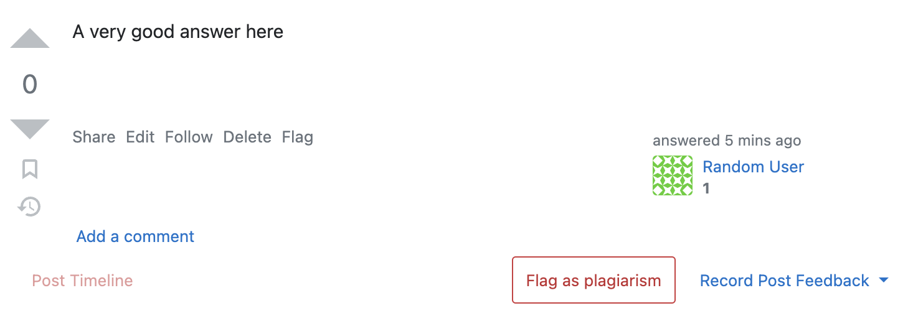
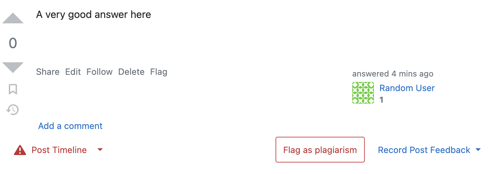
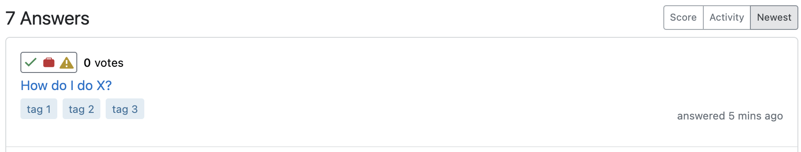
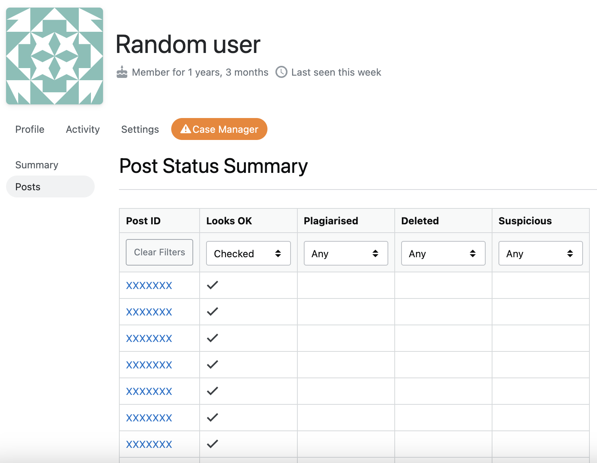
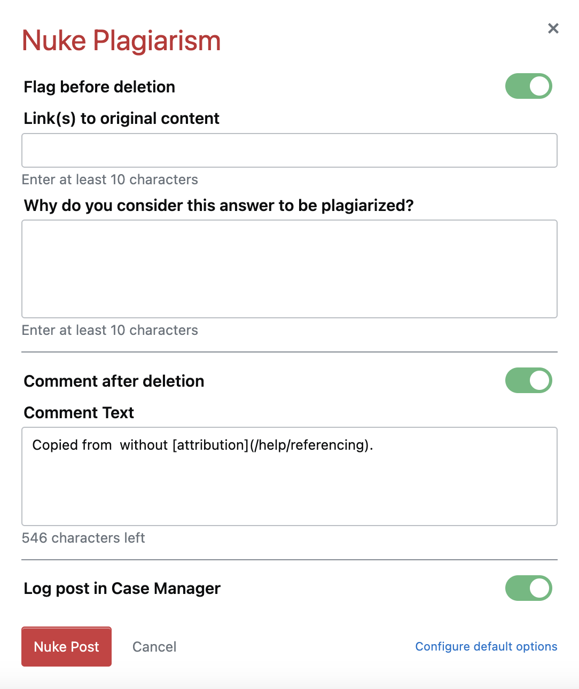
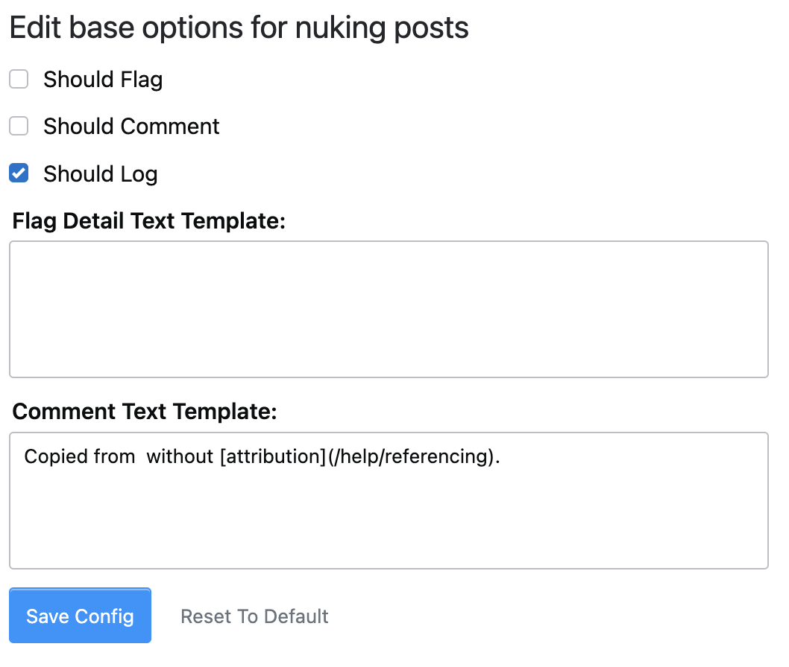

# Case Manager UserScript

A UserScript to help organise and coordinate plagiarism investigations on Stack Overflow.

Requires `GM_getValue`, `GM_setValue`, and `GM_deleteValue` to store access_tokens.

## Review Posts

On all posts (excepting those you authored) there is a control panel.

There are three options "Record Post Feedback," "Flag as plagiarism," and "Post Timeline".

### Recording Post Actions

You can use "Record Post Feedback" to provide feedback to Case Manager. This will let others know that this
post has been already been evaluated/handled in some way.

#### How to know which feedback to select

| Feedback    | Reason                                                                                                                                                                                      |
|-------------|---------------------------------------------------------------------------------------------------------------------------------------------------------------------------------------------|
| Looks OK    | Indicates that the post is likely not plagiarised.                                                                                                                                          |
| Plagiarised | Indicates the post is plagiarised.                                                                                                                                                          |
| Suspicious  | "Looks OK" but it... doesn't. Indicates the post is likely plagiarised even though a source could not be found or the discovered source is not definitive enough to merit flagging/removal. |

You can remove your feedback at any point by pressing the clear button in the "Record Post Feedback" popup.

### Flagging Posts

You can both flag and provide feedback in a single step with the flag as plagiarism form which can be accessed via the "Flag as plagiarism" button in the post control panel at the bottom of every answer.

This form will allow you to fill out the relevant information to raise a "PlagiarizedContent" flag and choose to log feedback via a toggle.

The modal is draggable and will preserve data even if the modal is closed (but will not preserve through page reloads).

### Viewing Post Timeline

If the post already has feedback (this is any feedback including "Looks OK"), the "Post Timeline" button will become enabled and have an indicator

Clicking on the "Post Timeline" button will let you view the timeline of previous feedback on the post and who logged it.

### Summary Profile Indicator

Any posts which have any feedback logged in the system, will also have an indicator on the user's answers tab /user?tab=answers.

There can be up to 3 different indicators on a post indicating feedback given.

1. A checkmark indicates the post received feedback "Look OK"
2. A red suitcase indicates the post is plagiarised and has been flagged ("Plagiarised" feedback)
3. A yellow triangle alert indicates the post is suspicious ("Suspicious" feedback)

Here is what a post with all 3 indicators would look like:

---

## User Profile

You are able to open investigations into users by going to their profile.

At the top of all profiles (except your own) there is a "Case Manager" button

The button will gain an alert indicator if the user has ever had a post recorded in the system (for any reason).

### Profile Stats and Managing Cases

Clicking the button will take you to their summary stats page

This will show the number of posts with each feedback, as well as allow you to open an investigation into the user.

For users that are currently being investigated, you can also close a case from here.

### Links to Specific Posts

#### Table Info

Clicking on the Posts tab will give you a table posts recorded in the system. The first column is a link to the post.
The remaining columns represent the available feedback types. A checkmark indicates which feedback has been given.

**Note**: Every row will have at least one checkmark as only posts which have feedback on them will be logged in this
table.

#### Filtering Posts

Changing the selection box at the top of each column will affect which rows are displayed.

For each column there are three options:

- **Any** (Any value is in the specified column is acceptable. Basically does not affect if the row is displayed or
  not.)
- **Checked** (The value in the specified column _must_ be a checkmark.)
- **Unchecked** (The value in the specified column _must_ be empty (without a checkmark).)

Multiple feedback filters can be selected to limit the display to only posts with a specific combination of feedbacks (_e.g._ Plagiarised but not Deleted).

At any time the "Clear Filters" button in the first column can be used to clear all filters (reset all columns to "Any").

---

## All Users

At any point you can go to the /users tab and click on the "Plagiarist" page:

[![][9]][9]

This will allow you to search for users who have open cases, closed cases, or all users.

You can use the search bar to filter users by username.

[![][10]][10]

---

## Personal Credentials

### Initially Obtaining Credentials

When first opening the application you will be asked to go through and authorize yourself via the Stack Exchange API.

On any page that the script runs (like [your profile page](https://stackoverflow.com/users/current)), you will be presented with a modal to authorise the app.

[![][11]][11]

Click "Authorise App" and approve access to your account. You will need at least 1 API quote remaining (of 10,000) for it to confirm your account information.

Eventually you will be directed to a page with your access token

[![][12]][12]

Copy the access_token into the modal, then click "Save":

[![][13]][13]

### Managing Existing Credentials

#### General Credential Information

You can invalidate any specific credential or de-authenticate the application via the Case Manager Settings.

It is preferable to invalidate or de-authenticate via this interface because it will both remove any stored credentials in the system _and_ those on the SE API side.

The SE access token is always valid (unless it is invalidated) and can be used to obtain new access credentials. The access credentials (jwt) will expire after a period of time, but a new token will be automatically be requested when making any Case Manager API request after expiry.

If you invalidate your credentials for a different device, you will need to manually clear out the credentials from your UserScript manager storage as you will start returning 403s for all requests, however, you will not be prompted to re-authenticate because the script will see _a_ token is available.

Your token is __not__ cleared when receiving a 403 (except for 403s in response to requesting a new token) because a 403 response does not always indicate the token has been invalidated. Sometimes it can be returned for accidental requests to something you do not have access to (like active case status for your own account).

#### Management Console

On your profile there will be a "Case Manager Settings" button.
[![][14]][14]

Clicking on the tab will bring you to the [UserScript Settings page][settings page]. Here you can:

1. retrieve a new access token (for whatever reason)
2. invalidate any existing access tokens (invalidating the access token currently being used on this device will also remove it from GM storage)
3. de-authenticate the entire application, which will invalidate all access tokens, remove the app from your approved applications list, and remove all stored credentials in the database.

[![][15]][15]

## Moderator Tools

### Nuke Post

#### Post-specific options

Moderators gain access to an additional button on each post, which allows the post to easily be removed and feedback provided to the Case Manager.

Clicking this button opens a modal with options:

There are three options available and up to 4 actions will be taken. The post **will always be deleted** even if all options are unchecked.

When the Nuke button is pressed:

1. The character count is validated depending on which options are selected. Comments, Flag Source, and Flag details have different length requirements, all limits are validated based on the selected options.
2. If the Flag option is selected, the post is flagged using the text in the flag source and flag detail textareas. If the flag operation fails no further actions are taken (an error is displayed).
3. A "Delete as plagiarism" vote is added to the post which will mark the plagiarism flag helpful and apply plagiarism penalties. If the delete operation fails, no further action is taken.
4. If the Comment option is selected, a comment is added to the post.
5. If the Log option is selected, feedback is logged in the Case Manager. The post is marked as "Plagiarised" and "Deleted".

#### Detail Text manager

Moderators also have an additional option in their [settings page] to specify what the default form values for nuking
posts.

| Field                 | Default      | Description                                                                                                                                                                           |
|-----------------------|--------------|---------------------------------------------------------------------------------------------------------------------------------------------------------------------------------------|
| Flag Template Text    | Empty String | Populates the textarea with a string to easily provide flag details                                                                                                                   |
| Comment Template Text | Empty String | Populates the textarea with a string to easily comment on posts                                                                                                                       |
| Should Flag           | Unchecked    | Flag post by default. This is false by default because many instances of plagiarism are brought to moderator attention via custom flag, and would not normally require a second flag. |
| Should Comment        | Unchecked    | Leave a comment on the post by default. This is false by default since "Delete as plagiarism" now causes the UI to show the reason for deletion.                                      |
| Should Log            | Checked      | Log feedback with Case Manager. This is true by default to help to record patterns of behaviour.                                                                                      |

---

## Compatible Extras

This UserScript is compatible with [Textarea Reducer Stacks Controller](https://github.com/HenryEcker-SO-UserScripts/SO-UserScripts/blob/main/RegisterTextareaReducer.user.js) ([install](https://github.com/HenryEcker-SO-UserScripts/SO-UserScripts/raw/main/RegisterTextareaReducer.user.js)). This is an optional add-on which will
replace text as you type to minimise the number of characters in the textarea. Some examples of supported 
reductions are converting the
full answer URL to `/a/{answerId}` and converting comment URLs to `/posts/comments/{commentId}`.

[settings page]: https://stackoverflow.com/users/current?tab=case-manager-settings

[9]: ./readme-images/Search/users-plagiarist-tab.png

[10]: ./readme-images/Search/plagiarist-page.png

[11]: ./readme-images/Settings/auth%20modal.png

[12]: ./readme-images/Settings/auth%20token.png

[13]: ./readme-images/Settings/auth%20modal%20entry.png

[14]: ./readme-images/Settings/User%20Profile%20Settings%20button.png

[15]: ./readme-images/Settings/Case%20Manager%20Auth%20Settings.png
